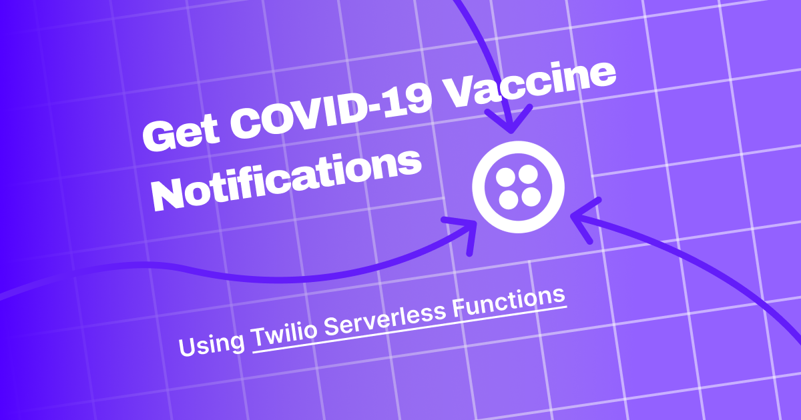
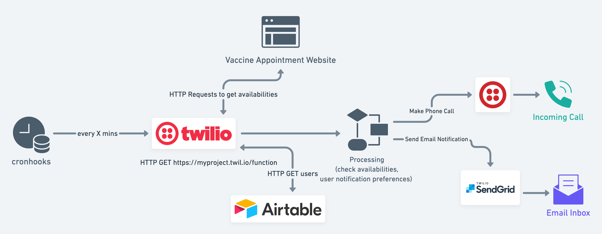

# Covid-19 Vaccine Appointment Notification System



## Getting Started
For a step-by-step guide on how to get setup, check out the [setup guide](https://ddxdevin.medium.com/build-a-covid-19-vaccine-appointment-notification-system-with-a-twilio-serverless-function-23cf328c01f4).

## Projects

There are multiple variations depending on the state or vaccination repository being monitored. Navigate to the sub-project's README for more information:

- California MyTurn System: [`california-myturn/`](./california-myturn)

- Massachusetts Covid Vaccines: [`massachusetts-macovidvaccines/`](./massachusetts-macovidvaccines)

- NYC Vaccine List (NYC Only): [`nyc-vaccinelist/`](./nyc-vaccinelist)

- Get My Vaccine (CVS, Rite-Aid, Walgreens): [`getmyvaccine/`](./getmyvaccine)

The architecture and processes defined in this document are shared and common between the sub-projects.

### Process

#### Architecture Overview


### 1. Cron Scheduler
Per a cron schedule, cronhooks makes a call to a webhook hosted by Twilio serverless functions.

### 2. Twilio Serverless Function Invocation
Twilio function is invocated and a script runs to:
1. Check the designated vaccine website for the latest availability status
2. Query Airtable for list of users
3. For each user, parse availabilities based on their preferences (desired locations to monitor or based on their user profile and thus, eligibility).
4. If there are availabilities, trigger a phone & email notification if enough time has passed since we last notified them (based on their preference). 
    - Twilio API to Call
    - SendGrid API to Email
5. Update Airtable DB with new timestamps for users if we notified them.

## "DB" Schema

The Airtable DB schema is different between state variations due to different use cases. Refer to the relevant sub-projects for details.

## External Services

### Twilio Serverless Functions
https://www.twilio.com/docs/runtime/functions

Twilio Functions are used to query the external vaccine availabilities endpoint, gather a list of users, filter vaccine availabilities based on user preferences, and call out to external services (Twilio, SendGrid) to trigger notifications if availabilities open that match the user's clinic criteria and notification preferences.

We write the function in Node/Javascript as a "serverless function" and Twilio exposes an endpoint that can be used to trigger the function on-demand.

To get started, you will need to create a Twilio account and register a phone number to use for your service. 

Twilio Pricing
- $1/month for PAYG phone number
- [Voice PAYG Pricing](https://www.twilio.com/voice/pricing/us)
- [Runtime Pricing](https://www.twilio.com/runtime/pricing)
  > First 10,000 invocations per month are free

### Twilio SendGrid 
https://sendgrid.com/

SendGrid is used to send email notifications to users. Although SendGrid is now under Twilio, you need to create a separate account under SendGrid with a SendGrid API token. If you anticipate less than 100 emails/day, you can get by with just the SendGrid free tier.

[SendGrid Pricing (Free Plan)](https://sendgrid.com/pricing/)
> 100 emails/day free forever

### Airtable
https://airtable.com/

Airtable is used as a simple database that we can interface with over a REST API to manage users. This can be adapted to use Google Sheets or another db storage mechanism. Airtable provides a simple way to use a spreadsheet-like interface to maintain records and should be free if you anticipate <1,200 user records.

A sample Airtable "Base" schema can be found in the subprojects under `assets/airtable_sample.csv`.

[Airtable Pricing (Free Plan)](https://airtable.com/pricing)
> Free Plan: 1,200 records per base

### cronhooks
https://cronhooks.io/

cronhooks.io is used as a recurring scheduling mechanism to trigger our Twilio function. Let's say we want to run our Twilio function every 5 mins to repeatedly check whether or not availabilities have opened up and if so, send users a notification. We'll need a mechanism to call the Twilio function endpoint on a recurring basis.

From the Twilio blog, I went with cronhooks.io from their recommended list of easy ways to schedule functions: https://www.twilio.com/blog/4-ways-to-schedule-node-code 

[cronhooks pricing (Basic Plan)](https://cronhooks.io/#pricing)
- $3/month Basic Plan gives you 50 webhooks and the ability to schedule a recurring webhook. The Free plan does not let you schedule a recurring webhook.

## Deployment

### Airtable Schema

1. Create a new Base in airtable for your project
2. Upload the sample CSV file to get started on the correct schema
3. Ensure the field types are correct 
    - For DateTime values, choose Date with Time + 24hr + GMT
    - For regular string values, choose single or multi line text
    - For numbers (time thresholds), choose Number [Integer, do not allow negative]
4. Use https://airtable.com/api to figure out what your base's API endpoint is

### Twilio SendGrid

- Create account and make sure you have your FROM Sender e-mail address and your SendGrid API token. They should be added to the ENV variables of your serverless function.

### Twilio Serverless

- Create a new Service (FKA Function) and copy the JS script over (ma-notify, ca-myturn-notify, etc.) and replace everything in the boilerplate file in Twilio.
- Set up your environment variables (Twilio ACCOUNT SID and AUTH_TOKEN should automatically be present). Refer to the sample `.env` file in each subproject. You'll need to add Airtable API keys + Base API Endpoint, SendGrid API Key + Sender Email Address, and Twilio Phone Number (your dedicated purchased number) + Twilio TwiML Bin.
- Add `axios` and `cheerio` dependencies in the function settings.
   - `axios` is used to make the API calls but the code can be refactored to just use native `fetch`
   - `cheerio` is used only in the NYC and GetMyVaccine variants as we need to parse the DOM of the nycvaccinelist index page, as there is no reliable JSON endpoint (the API endpoint changes with each Vercel/Next deploy)

- Create new TwiML bin with the sample XML file in the sub-project. This is used to programmatically control what the automated voice says when the user picks up the phone call - you can modify this to customize to your needs.

- Save and deploy your function and ensure it's publicly accessible. A GET request to your endpoint will trigger the function!

### cronhooks

- Make an account and upgrade to basic plan.
- Create new hook where the webhook URL is your twilio serverless function URL.
- Choose a cron schedule that works for you. Use https://crontab.guru/examples.html to assist in generating a valid crontab syntax.

## Performance

The initial project was written to support operating on only a few users. With certain systems requiring many API calls to scrape status (MyTurn is minimum four calls in best case scenario), this can become unwieldly. There are several synchronous pieces of logic that are blocking and rely on the prior step. (Get users first, then find availabilities, and then update user)

With AWS Lambda / Twilio Functions, the function handler will quit immediately and it will not wait for your logic to complete if you don't return a Promise that needs to be resolved. And with an execution time limitation of 10 seconds, we are limited to how much we can do.

To support more than a few users, this project would need to be adapted to fan-out each user over a pub-sub implementation (Use AWS Lambda with SQS?) to run more performantly. Note that depending on the service, we sometimes have a central data set that we can operate on and other times, the data set is tailored to the user. For example:

- For MA COVID Vaccines, the entire JSON data set is the latest availabilities for the state and is not catered to the user's profile.
- Meanwhile for CA MyTurn, we need to make certain API requests based on the user's age/industry/etc. before we can get availabilities.

Scaling out the MA use case is easier since we can just query for the data set once and reuse across all users, while for CA, we can't share a common data set. 


## Local Development

To develop and run the function locally, update the sample `.env` file with your service api keys and credentials. 

Ensure you have `npm` and `node` on your machine. Twilio Serverless production runs node 10.x or 12.x so it would be better to use [nvm](https://github.com/nvm-sh/nvm) to ensure you're running 10.x/12.x locally to develop in line with how functions are executed in Twilio prod environments. 

### Start Twilio Serverless Toolkit Development Server
#### 1) Navigate into the relevant project 
`cd california-myturn` or `cd massachusetts-macovidvaccines` or `cd nyc-vaccinelist`

#### 2) npm 
```
npm i
```

#### 3) Start Server
Once you run `npm i`, you can leverage the `twilio-run` dev dependency to run a local server that mimics the Twilio serverless function environment. You don't need the full `twilio-cli` tool for the purposes of this project.

Start the Twilio Development Server
```
node_modules/.bin/twilio-run
```

Use an API program ([Postman](https://www.postman.com/), [Insomnia](https://insomnia.rest/), etc.) or just a cURL command to trigger the function endpoint
```
curl --location --request GET 'http://localhost:3000/ma-notify'
```
```
curl --location --request GET 'http://localhost:3000/ca-myturn-notify'
```
```
curl --location --request GET 'http://localhost:3000/nyc-notify'
```
```
curl --location --request GET 'http://localhost:3000/gmv-notify'
```

The cURL command should just return a basic "Success" payload
```
$ curl --location --request GET 'http://localhost:3000/ma-notify'

Success%
```

The Twilio Dev Server should show a request with 200 OK Response
```
┌──────────────────────────────────────────────────────────────────────────┐
│                                                                          │
│   Twilio functions available:                                            │
│   └── /ma-notify | http://localhost:3000/ma-notify                       │
│                                                                          │
│   Twilio assets available:                                               │
│   ├── /airtable_sample.csv | http://localhost:3000/airtable_sample.csv   │
│   └── /covid-alert.xml | http://localhost:3000/covid-alert.xml           │
│                                                                          │
└──────────────────────────────────────────────────────────────────────────┘
200 GET /ma-notify │ Response Type text/plain; charset=utf-8
```

#### Debug Mode
Set the `DEBUG_MODE` environment variable to true if you want to send a notification to test, even if there are no availabilities. 
