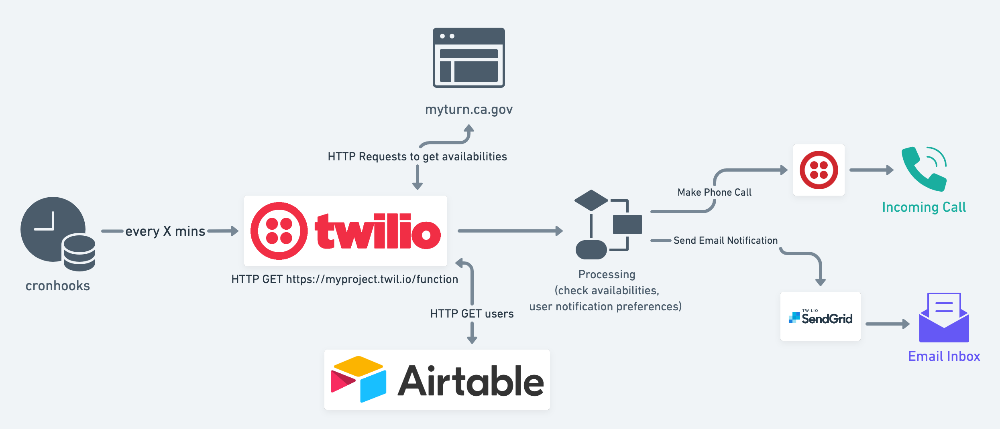

# Covid-19 Vaccine Appointment Notification System: California

## Overview

## CA-specific Details

The API calls are querying the CA website: [MyTurn](https://myturn.ca.gov/)

As part of the availability check, we check if the user is eligible before searching for available appointments. The eligibility criteria for the user is reflected in the user schema.

### Process to check for availability
1) Check if user is eligible
2) If user is eligible, check for available locations near user lat/long
3) If there are locations near lat/long, check if there are available dates at locations.
4) If any location has available dates, notify user.

## "DB" Schema for CA

User Object

| Column      | Airtable Field Name | Description |
| ----------- | ----------- | ----------- |
| User Name      | `name`       | Name of user is used in the phone call speech script |
| User Email   | `email`        | SendGrid recipient email destination |
| Phone Number   | `phone`        | Twilio calls this number to notify |
| Last Call   | `last_call`        | DateTime of when we last called the user's phone number |
| Last Email   | `last_email`        | DateTime of when we last emailed the user |
| Call Time Threshold   | `min_call_threshold`        | User preference for how many minutes should pass before we call them again. (We can check for available updates every 5 minutes and call a user if something becomes available but don't call them again until an hour later, if this value is set to `60`. This prevents repeated calls every time the cron job runs if there are consistently available appointments.) |
| Email Time Threshold   | `min_email_threshold`        | Similar to Call Time Threshold, but for emails. |
| Age Range   | `age_range`        | Eligibility input for MyTurn for patient age range. Used to determine eligibility before querying for available appointments. Acceptable values listed below. |
| County   | `county`        | Eligibility input for MyTurn for county. Used to determine eligibility before querying for available appointments. Acceptable values listed below. |
| Industry/Occupation   | `industry`        | Eligibility input for MyTurn for patient occuptation. Used to determine eligibility before querying for available appointments. Acceptable values listed below. |
| Latitude   | `lat`        | Latitude coordinates. Used when searching for nearby clinic locations. Oakland Coliseum example: `37.746080` |
| Longitude   | `long`        | Longitude coordinates. Used when searching for nearby clinic locations. Oakland Coliseum example: `-122.195133` |

### Eligibility Acceptable Values

#### `age_range` values
`"18 - 49"`, `"50 - 64"`, `"65 - 74"`, `"75 and older"`

#### `county` values
Alameda, Alpine, Amador, Berkeley, Butte, Calaveras, Colusa, Contra Costa, Del Norte, El Dorado, Fresno, Glenn, Humboldt, Imperial, Inyo, Kern, Kings, Lake, Lassen, Long Beach, Los Angeles, Madera, Marin, Mariposa, Mendocino, Merced, Modoc, Mono, Monterey, Napa, Nevada, Orange, Pasadena, Placer, Plumas, Riverside, Sacramento, San Benito, San Bernardino, San Diego, San Francisco, San Joaquin, San Luis Obispo, San Mateo, Santa Barbara, Santa Clara, Santa Cruz, Shasta, Sierra, Siskiyou, Solano, Sonoma, Stanislaus, Sutter, Tehama, Trinity, Tulare, Tuolumne, Ventura, Yolo, Yuba

#### `industry` values

"Chemical and hazardous materials", "Communications and IT", "Critical manufacturing", "Defense", "Education and childcare", "Emergency services", "Energy", "Financial services", "Food and Agriculture", "Government operations / community based essential functions", "Healthcare Worker", "Industrial, commercial, residential, and sheltering facilities and services", "Retired", "Transportation and logistics", "Unemployed", "Water and wastewater", "Other", 