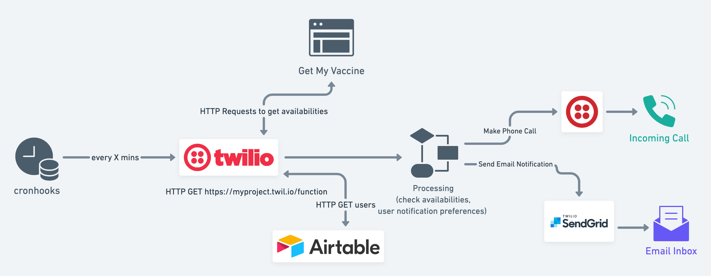

# Covid-19 Vaccine Appointment Notification System: GetMyVaccine (CVS, Rite-Aid, Walgreens)

## Overview

## Eligibility

Eligibility is not taken into account during availability checks. Get My Vaccine is aggregating vaccine appointments from CVS, Rite-Aid, and Walgreens. You should ensure you are eligible based on current local rules before setting up a check.

## GetMyVaccine-specific Details

The API calls are querying the Get My Vaccine website: [Get My Vaccine](https://www.getmyvaccine.org/). 

### Data Freshness

GetMyVaccine is monitoring retail pharmacy websites and stores a timestamp for when they last checked the retail pharmacy's status. Use the `data_freshness` field in the User object to specify a preference to only filter by location availabilities if the data was recently updated wtihin X minutes. If `data_freshness` is set to `5`, we will filter GetMyVaccine's results to only look at results that show CVS/Rite-Aid/Walgreens had availabilities as of 5 minutes prior to the function invocation. 

Empty value for `data_freshness` will not filter any results. Recommendation is to set this field to a value like `5` to avoid triggering on stale collection data.

### Store Preference

Since GetMyVaccine is monitoring CVS, Rite-Aid, and Walgreens, you can opt to only montior a subset of these retailers. Empty value or empty array will monitor all 3 or you can specify with an array of strings (e.g. `["cvs"]` for CVS only or `["rite_aid", "walgreens"]` for Rite-Aid and Walgreens only).

### Time Threshold

Since inventory can change quite often, recommendation is to set a high value for `min_call_threshold` and `min_email_threshold`. For example, `1440`, to only call once a day (24 * 60 = 1440).

### Geography Preference

`zipcode` should be set to the user's main zipcode.

`distance` is a number (value for # of miles) from the zipcode, within which to search for locations

## "DB" Schema for Get My Vaccine

User Object

| Column      | Airtable Field Name | Description |
| ----------- | ----------- | ----------- |
| User Name      | `name`       | Name of user is used in the phone call speech script |
| User Email   | `email`        | SendGrid recipient email destination |
| Phone Number   | `phone`        | Twilio calls this number to notify |
| Last Call   | `last_call`        | DateTime of when we last called the user's phone number |
| Last Email   | `last_email`        | DateTime of when we last emailed the user |
| Call Time Threshold   | `min_call_threshold`        | User preference for how many minutes should pass before we call them again. (We can check for available updates every 5 minutes and call a user if something becomes available but don't call them again until an hour later, if this value is set to `60`. This prevents repeated calls every time the cron job runs if there are consistently available appointments.) |
| Email Time Threshold   | `min_email_threshold`        | Similar to Call Time Threshold, but for emails. |
| Data Freshness   | `data_freshness`        | Number of minutes. If `data_freshness` is set to `5`, we will filter availability results to only take into account retail pharamacy inventory that showed availabilities within 5 minutes prior to the function invocation.   |
| Store Preference   | `store_preference`        | Store preference between CVS, Rite-Aid, or Walgreens. Empty value or empty array will check all 3 stores. Other accepted values: `"cvs"`, `"rite_aid"`, `"walgreens"` Example value: `["cvs", "walgreens"]` |
| Zipcode   | `zipcode`        | User's zip code to use to search for locations |
| Distance   | `distance`        | Distance (in miles?) from the zipcode to filter locations by. Set to `10` to filter by locations within 10 miles of `zipcode` value. |
