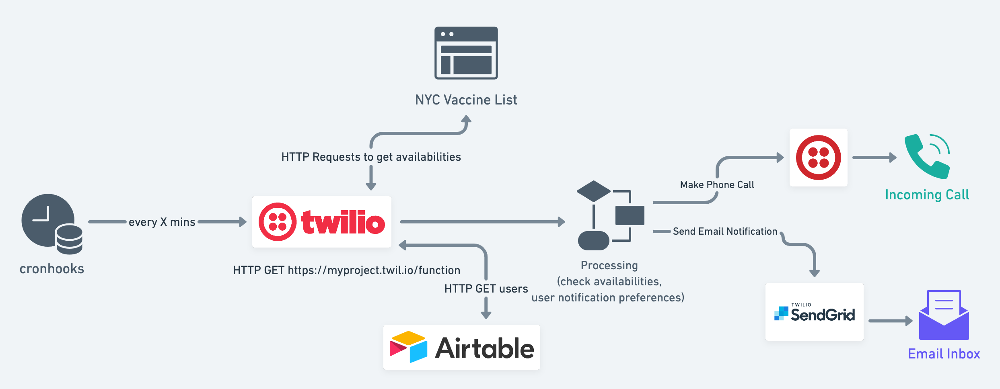

# Covid-19 Vaccine Appointment Notification System: NYC

## Overview



## NYC-specific Details

The API calls are querying the NYC Vaccine List website: [NYC Vaccine List](https://nycvaccinelist.com/)

There is no eligibility check as part of the monitoring process.

### Dose Preference

By default, the dose column should be left empty. This acts as a default filter to only look for locations offering the first dose. If the user wants to scope to only monitor locations with second doses, use `"Second Dose"` as the value for the `dose` column in Airtable.

### Location Preference

There can be many locations in NYC and some with restrictions. It is best for a user to specify which locations they want to monitor as availabilities can change frequently throughout the day. In the `locations` field in Airtable, specify an array of strings with the names of the locations from [NYC Vaccine List](https://nycvaccinelist.com/).

For example, to monitor just Medgar Evers College, the value for the user's `locations` field would be: 
```
["Medgar Evers College (Brooklyn)"]
```


## "DB" Schema for NYC

User Object

| Column      | Airtable Field Name | Description |
| ----------- | ----------- | ----------- |
| User Name      | `name`       | Name of user is used in the phone call speech script |
| User Email   | `email`        | SendGrid recipient email destination |
| Phone Number   | `phone`        | Twilio calls this number to notify |
| Last Call   | `last_call`        | DateTime of when we last called the user's phone number |
| Last Email   | `last_email`        | DateTime of when we last emailed the user |
| Call Time Threshold   | `min_call_threshold`        | User preference for how many minutes should pass before we call them again. (We can check for available updates every 5 minutes and call a user if something becomes available but don't call them again until an hour later, if this value is set to `60`. This prevents repeated calls every time the cron job runs if there are consistently available appointments.) |
| Email Time Threshold   | `min_email_threshold`        | Similar to Call Time Threshold, but for emails. |
| Dose Number   | `dose`        | Does the user need dose 1 or dose 2? `""` or no value is interpreted as 1st dose, while `"Second Dose"` is the valid value for searching for only second dose locations.
| Locations   | `locations`        | User preference for list of specific locations to monitor. Represented as array of strings: `["Location Name 1", "Location Name 2"]`
